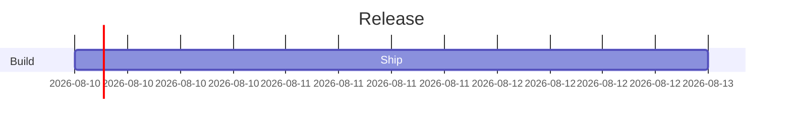

# UNRESOLVABLE_SCHEDULE

> UNRESOLVABLE_SCHEDULE is a structural error: a gantt schedule cannot be resolved to concrete dates, so bars cannot be positioned.

- **Tier:** structural
- **Severity:** error

## What triggers it

A task whose `after`/`until` expression references a task id that does not exist, or a start/end that cannot be parsed against the declared `dateFormat`. The warning carries the engine reason string.

## How to fix it

Point the reference at a real task id or give the task explicit dates with the `set_task_dates` mutation (or edit the offending source line named in the reason).

## Example

Run `am verify diagram.mmd --json`, inspect this code, and apply the smallest source or typed mutation that clears it. If it persists after two mechanical attempts, return the warning and ask for human review.

Full page: https://agentic-mermaid.dev/warnings/UNRESOLVABLE_SCHEDULE/
