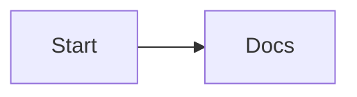

# UNSUPPORTED_SYNTAX

> UNSUPPORTED_SYNTAX is a lint warning: the source uses syntax or content the local structured model cannot faithfully express.

- **Tier:** lint
- **Severity:** warning

## What triggers it

Flowchart `click`/`href` directives, edge IDs and edge metadata, v11 `@{ shape: … }` node metadata, markdown strings, unclosed delimiters that would silently drop content, or `syntax: "empty_layout"` when content-bearing source lays out to a 0×0 canvas with no nodes, edges, or groups.

## How to fix it

For preserved Mermaid syntax, remove the directive if local rendering fidelity matters, or keep it knowing the local renderer ignores it; edits touching those lines need source-level editing rather than typed mutations. For `empty_layout`, inspect the warning message and `verify.layout`, then repair the malformed or unsupported source before accepting the artifact.

## Example

Run `am verify diagram.mmd --json`, inspect this code, and apply the smallest source or typed mutation that clears it. If it persists after two mechanical attempts, return the warning and ask for human review.

Full page: https://agentic-mermaid.dev/warnings/UNSUPPORTED_SYNTAX/
